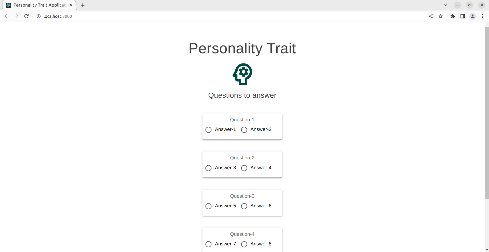
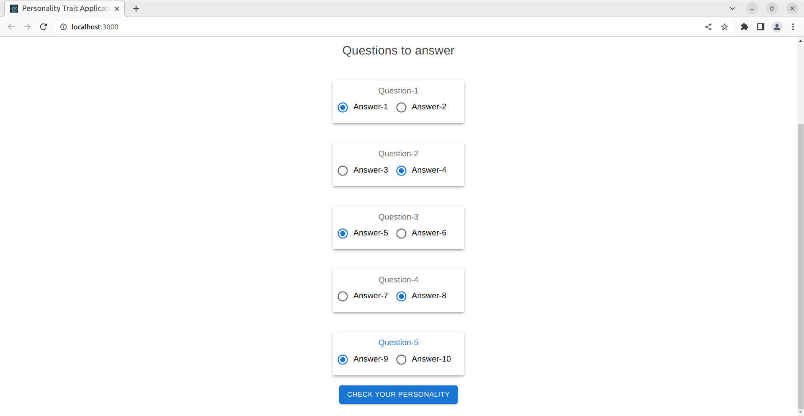
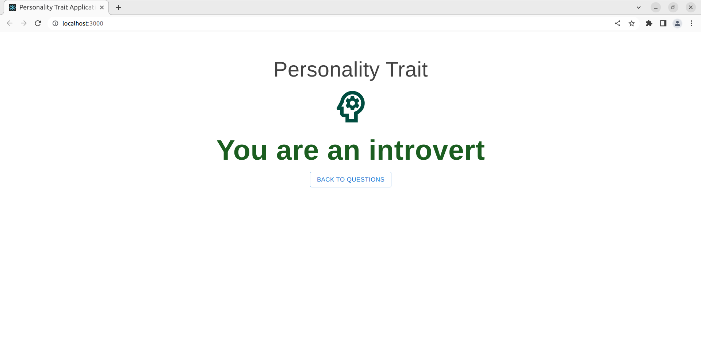

## Teamway Personality Trait Application

### Project Approach
This project will add, update & delete questions through REST APIs and check personality trait based on answers provided 
for the questions in the DB.

1. Created Question & Answer entities for saving questions & answers in the database.
2. Personality trait is mapped to ENUM of type `INTROVERT` and `EXTROVERT`.
3. Various layers flow
    Entity -> DAO -> Service -> Controller
4. Unit test cases added for Service layer.
5. In-memory database used for saving and retrieving questions
6. For conversion to Entity from DTO & vice-versa, mapper library is used.
7. Exception handler is created for handling exceptions.
8. ResponseSerializer object is returned as API response with unified format for all requests.
9. UI layer added, created using React & Material UI.
10. React components follows material ui conventions.
11. Docker support added, to run both backend & frontend docker containers, run the following commands:
```shell
cd teamway/
mvn clean package
docker build -t teamway-api:1.0.0 .
cd teamway-ui/
docker build -t teamway-ui:1.0.0 .
cd ..
docker-compose up
```



